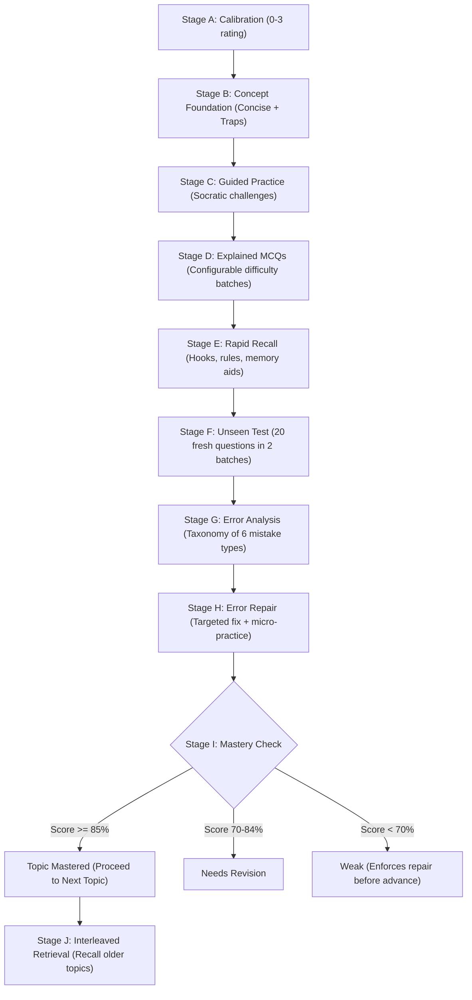

# ⚗️ Genesis Intake & Discovery State: Feynman Adaptive Engine

**Status:** RECONNAISSANCE DEEPENED (Wireframes, Architecture Images & Master Prompt Analyzed)  
**Date:** 2026-09-23  
**Stage:** Stage 0 (Roadmap & WBS Planner - Greenfield Genesis)

---

## 1. Grounded Visual & Architectural Reconnaissance (From `Image/`)

From detailed AST and visual analysis of the 4 uploaded blueprints:

### Blueprint 1: System Design & Resource Strategy (`2ndImage.jpeg`)
- **Template Core Composition:** Each template consists of:
  1. System Execution Prompt (Domain persona & pedagogical rules)
  2. Hierarchical Syllabus / Topic Map (Parent $\to$ Child topics with strict prerequisites)
  3. Reference Material Repository (30–40 past papers, syllabus guides, textbooks)
- **The Core Architectural Dilemma:** How to utilize 30–40 reference files without hitting context window caps or incurring massive LLM token costs:
  - *Option A:* Full-vector RAG (chunks + embeddings).
  - *Option B:* Topic-sliced curated context injection (only loading resources relevant to active topic).
  - *Option C:* Hybrid (Structured syllabus knowledge graph + targeted retrieval for MCQs and past-paper patterns).
- **Execution Lifecycle on Topic:** Runs iteratively until the topic is mastered:
  - Equation rendering (KaTeX/LaTeX).
  - Interactive quiz creation (incremental batches).
  - User answer submission & evaluation.
  - Interactive charts/graphs and result cards.
  - Topic completion progress tracking.

### Blueprint 2: Mobile Interface & Interaction Architecture (`3rd.jpeg`)
- **Header:** Sticky status/progress bar, current topic indicator, profile modal button.
- **Side Drawer:** Responsive history drawer organizing sessions by template $\to$ topic/concept iteration.
- **Feed & Interactive Artifacts:**
  - Dynamic conversational stream.
  - Interactive Quiz Cards (clickable options, immediate feedback).
  - Quiz Result Cards & Analytics.
  - Flashcard flip views.
  - KaTeX mathematical and scientific equation rendering.
  - Clipboard / Edit / Feedback thumbs-up/down controls.
- **Input Bar:**
  - `+` Action button (opens iteration/topic picker or file modal).
  - Responsive auto-growing text area.
  - Voice / TTS audio integration.
  - Send button.

### Blueprint 3: Landing / Home Dashboard (`3rdImage.jpeg`)
- **Header:** Product brand logo, User Profile with collapsible usage & credit modal.
- **Template / Notebook Cards Grid:**
  - `+` Card: Template creation (admin-restricted).
  - Pre-built Course Cards: **LAT Preparation**, **MDCAT**, **SAT Preparation**, **Socratic Tutor**, **University Prep**.
  - Access model: Free tier initially; extensible to paywalled templates.

### Blueprint 4: Execution Architecture & State Modals (`WhatsApp Image ...jpeg`)
- **Separation of Concerns:** Clean decoupled Frontend $\longleftrightarrow$ Backend architecture.
- **Interactive Progress Modal:** Tapping progress exposes hierarchical completion (Subject $\to$ Topic $\to$ Sub-topic $\to$ Mastery %).
- **Event-Driven Artifacts:** The backend emits structured events/delimiters (e.g. `<quiz-batch>...</quiz-batch>`) that the frontend parses into rich interactive widgets instead of raw markdown text walls.

---

## 2. Deconstruction of the "LAT AI Master Execution Prompt"

The prompt provides the gold-standard reference for the engine's pedagogical state machine:

